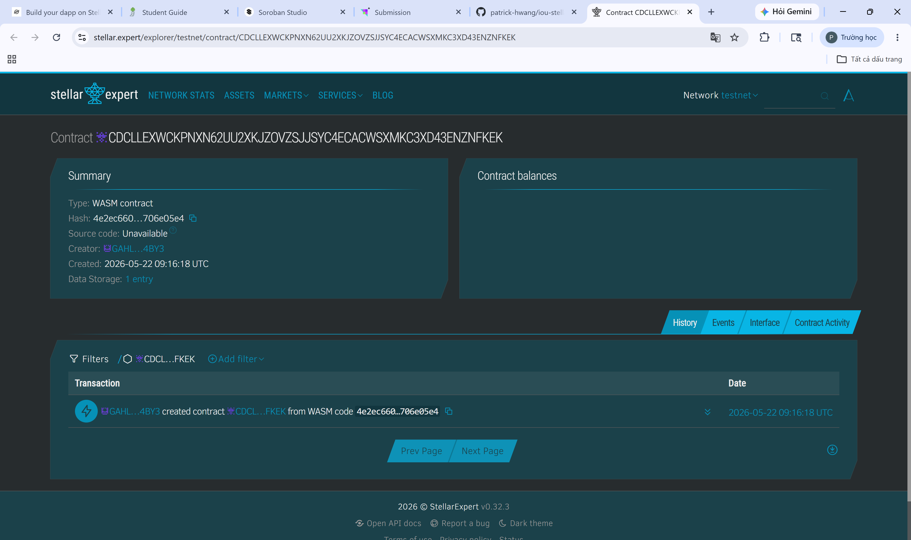

# I Owe You (IOU) - Decentralized Debt Tracker

## Who am I
- **Name:** Hien
- **Role:** Python Developer & Blockchain Enthusiast
- **Background:** I specialize in machine learning, computer vision, and P2P protocol analysis. I am currently exploring Web3 and building decentralized applications on the Stellar network.

## Project Details
Students often have multiple overlapping micro-debts (e.g., splitting food or drink bills). Manual tracking is prone to errors and lost records. Using standard note-taking apps lacks mutual consensus and transparency, as records can be easily altered or deleted. 

"I Owe You" is a decentralized debt tracking system built on the Stellar blockchain. All debts are recorded on-chain, ensuring complete transparency. Data cannot be unilaterally modified or deleted without the cryptographic signatures of the involved parties, establishing absolute trust when reconciling balances. The core features include recording debts, clearing debts, and a transitive debt netting algorithm (e.g., if A owes B, and B owes C, A can pay C directly to settle both debts).

## Vision
To eliminate the friction, awkwardness, and complexity of peer-to-peer micro-debts by providing a trustless, automated, and near-feeless decentralized ledger for everyday use.

## Why Stellar
If deployed on other blockchains (like Ethereum), continuously updating debt states could cost significant gas fees and take minutes to confirm. In traditional finance, settling transitive debts requires manual calculation or cumbersome bank transfers. 

With Stellar, executing this smart contract logic takes only ~5 seconds with virtually zero fees (~$0.000003). This speed and cost-efficiency make it the perfect network for users to record and settle daily micro-debts without losing money to transaction fees.

## Target User
Students and individuals who need to manage group expenses or peer-to-peer micro-loans.

## Live Demo
- **Network:** Stellar Testnet
- **Contract ID:** `CDCLLEXWCKPNXN62UU2XKJZOVZSJJSYC4ECACWSXMKC3XD43ENZNFKEK`
- **Transaction Link:** [Insert your Stellar Expert transaction link here]

## Tech Stack
- **Smart Contract:** Rust / Soroban SDK v22
- **Network:** Stellar Testnet
