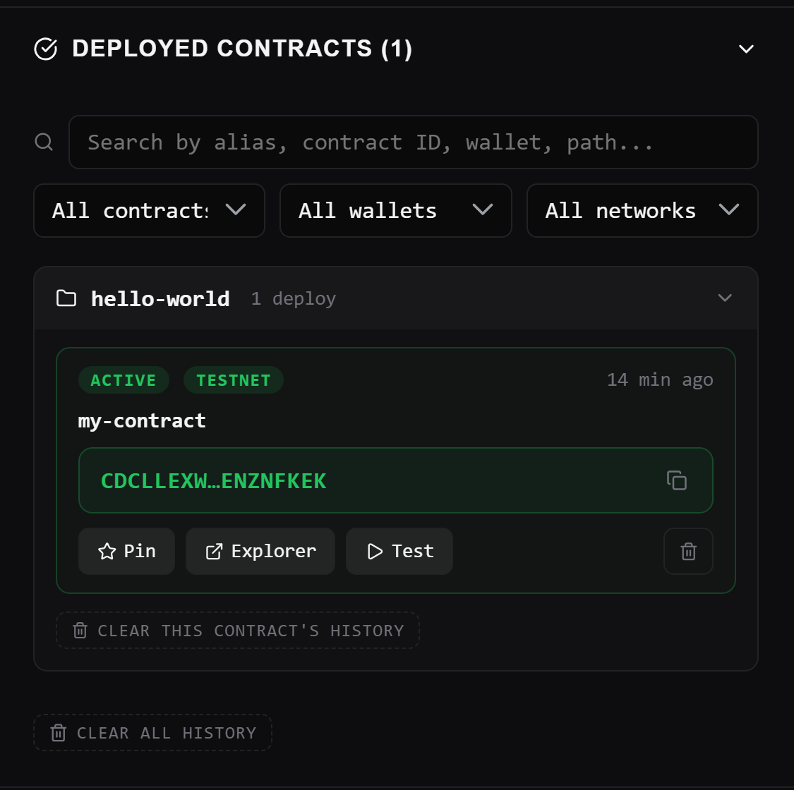

# I Owe You - Decentralized Debt Tracker

## Problem
Sinh viên thường có nhiều khoản nợ vi mô chéo nhau (tiền ăn, trà sữa...) nhưng việc ghi chép thủ công dễ gây nhầm lẫn, thất lạc. Việc sử dụng các ứng dụng ghi chú thông thường thì không đảm bảo sự đồng thuận và tính minh bạch giữa các bên (dễ bị sửa đổi hoặc xóa file).

## Solution
Xây dựng một hệ thống IOU (I Owe You) phi tập trung trên blockchain. Mọi khoản nợ được lưu on-chain đảm bảo tính minh bạch, dữ liệu không thể bị đơn phương chỉnh sửa hoặc xóa bỏ nếu không có chữ ký xác thực của các bên liên quan, tạo niềm tin tuyệt đối khi đối soát.

## Why Stellar
Nếu triển khai trên các blockchain khác (như Ethereum), việc liên tục cập nhật trạng thái nợ có thể tốn từ vài đô đến hàng chục đô la phí gas cho mỗi thao tác và mất vài phút để xác nhận. Trong tài chính truyền thống, việc đối trừ nợ bắc cầu (A nợ B, B nợ C nên A trả thẳng C) đòi hỏi người dùng phải tự tính toán thủ công hoặc qua trung gian ngân hàng tốn nhiều ngày rườm rà. 

Với Stellar, mọi thao tác xử lý logic hợp đồng này chỉ mất ~5 giây với mức phí gần như miễn phí (khoảng $0.000003). Tốc độ và chi phí này cực kỳ hoàn hảo để người dùng ghi nhận hoặc thanh toán các khoản nợ vi mô lẻ tẻ hàng ngày mà không bị "lỗ" tiền phí.

## Target User
Sinh viên và những người có nhu cầu quản lý các khoản chi tiêu/vay mượn nhóm.

## Live Demo
- **Network:** Stellar Testnet
- **Contract ID:** `CDCLLEXWCKPNXN62UU2XKJZOVZSJJSYC4ECACWSXMKC3XD43ENZNFKEK`
- **Transaction Link:** `https://stellar.expert/explorer/testnet/contract/CDCLLEXWCKPNXN62UU2XKJZOVZSJJSYC4ECACWSXMKC3XD43ENZNFKEK`

## Tech Stack
- **Smart Contract:** Rust / Soroban SDK v22
- **Network:** Stellar Testnet

## Team
- Name: Hoàng Đức Hưng Phát
- Email: hoangduchungphat85@gmail.com